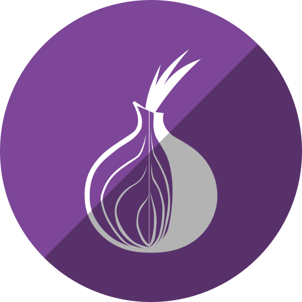
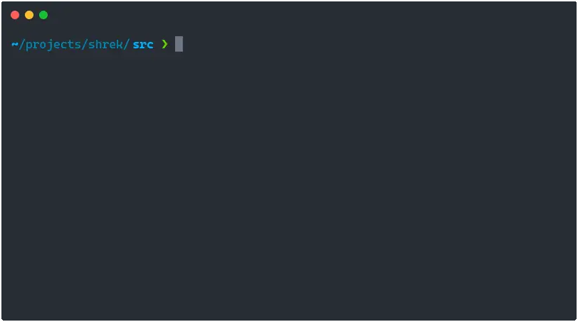

<div align="center">

# Shrek 

[![Go Reference   ][goref-badge]][goref-page]&nbsp;
[![GitHub Release ][ghrel-badge]][ghrel-page]&nbsp;
[![Project License][licen-badge]][licen-page]&nbsp;
<!-- [![Go Report      ][gorep-badge]][gorep-page]&nbsp; -->
<!-- [![Go Version     ][gover-badge]][gover-page]&nbsp; -->

Shrek is a vanity `.onion` address generator written in Go.



</div>

# Usage (CLI)

Shrek compiles to a single binary that can be used on the CLI. To build and install:

```bash
go install github.com/innix/shrek/cmd/shrek@latest
```

This will place the shrek binary in `$GOPATH/bin`. Alternatively you can grab a static build from
the [GitHub Releases](https://github.com/innix/shrek/releases) page.

The program takes 1 or more filters as arguments. It only generates v3 addresses.

```bash
# Generate an address that starts with "food":
shrek food

# Generate an address that starts with "food" and ends with "xid":
shrek food:xid

# Generate an address that starts with "food" and ends with "bid", or starts with "barn":
shrek food:bid barn

# Shrek can search for the start of an onion address much faster than the end
# of the address. Therefore, it is recommended that the filters you provide have a
# bigger start filter and a smaller (or zero) end filter.

# Generate an address that ends with "2ayd".
shrek :2ayd
```

To see full usage, use the `-h` flag:

```bash
shrek -h
```

# Usage (library)

You can use Shrek as a library in your Go code. Add it to your `go.mod` file:

```bash
# Run in your project root, where your go.mod file is.
go get github.com/innix/shrek
```

Here's an example of finding an address using a start-end pattern and saving it to disk:

```go
package main

import (
	"context"
	"fmt"

	"github.com/innix/shrek"
)

func main() {
	// Brute-force find a hostname that starts with "foo" and ends with "id".
	addr, err := shrek.MineOnionHostName(context.Background(), nil, shrek.StartEndMatcher{
		Start: []byte("foo"),
		End:   []byte("id"),
	})
	if err != nil {
		panic(err)
	}

	// Save hostname and the public/secret keys to disk.
	fmt.Printf("Onion address %q found, saving to file system.\n", addr.HostNameString())
	err = shrek.SaveOnionAddress("output_dir", addr)
	if err != nil {
		panic(err)
	}
}
```

# Performance

Shrek is the fastest `.onion` vanity address generator written in Go (at time of writing), but it's
still very slow compared to native C programs like [`mkp224o`](https://github.com/cathugger/mkp224o).
There are likely optimizations that could be made by someone smarter than me. If you fancy the
challenge, feel free to make a pull request with your optimizations.

The primary goal of Shrek is to be an easy to use Go program/library for Go developers, not to be the
fastest program out there. It should be able to run on every platform that Go supports. Use of `cgo`
or other complicated build processes should be avoided.

You can find the slow parts of the codebase by running the benchmarks:

```bash
go test -bench=.
```

# FAQ

## Are v2 addresses supported?

No. They were already deprecated at the time Shrek was written, so there didn't seem any point
supporting them. There are no plans to add it as a feature.

## Why "Shrek"?

Onions have layers, ogres have layers.

# License

Shrek is distributed under the terms of the MIT License (see [LICENSE](LICENSE)).


<!-- Link refs -->
[goref-badge]: <https://img.shields.io/badge/-reference-007d9c?style=for-the-badge&logo=go&labelColor=5c5c5c&logoColor=ffffff> "Go pkg.dev badge"
[goref-page]: <https://pkg.go.dev/github.com/innix/shrek> "Go pkg.dev"

[ghrel-badge]: <https://img.shields.io/github/v/release/innix/shrek?display_name=tag&sort=semver&style=for-the-badge> "GitHub Releases badge"
[ghrel-page]: <https://github.com/innix/shrek/releases> "GitHub Releases"

[gorep-badge]: <https://goreportcard.com/badge/github.com/innix/shrek?style=for-the-badge&logo=go> "Go Report badge"
[gorep-page]: <https://goreportcard.com/report/github.com/innix/shrek> "Go Report"

[gover-badge]: <https://img.shields.io/github/go-mod/go-version/innix/shrek?style=for-the-badge&logo=go> "Go Version badge"
[gover-page]: <go.mod> "Go Version"

[licen-badge]: <https://img.shields.io/github/license/innix/shrek?style=for-the-badge> "Project License badge"
[licen-page]: <LICENSE> "Project License"
